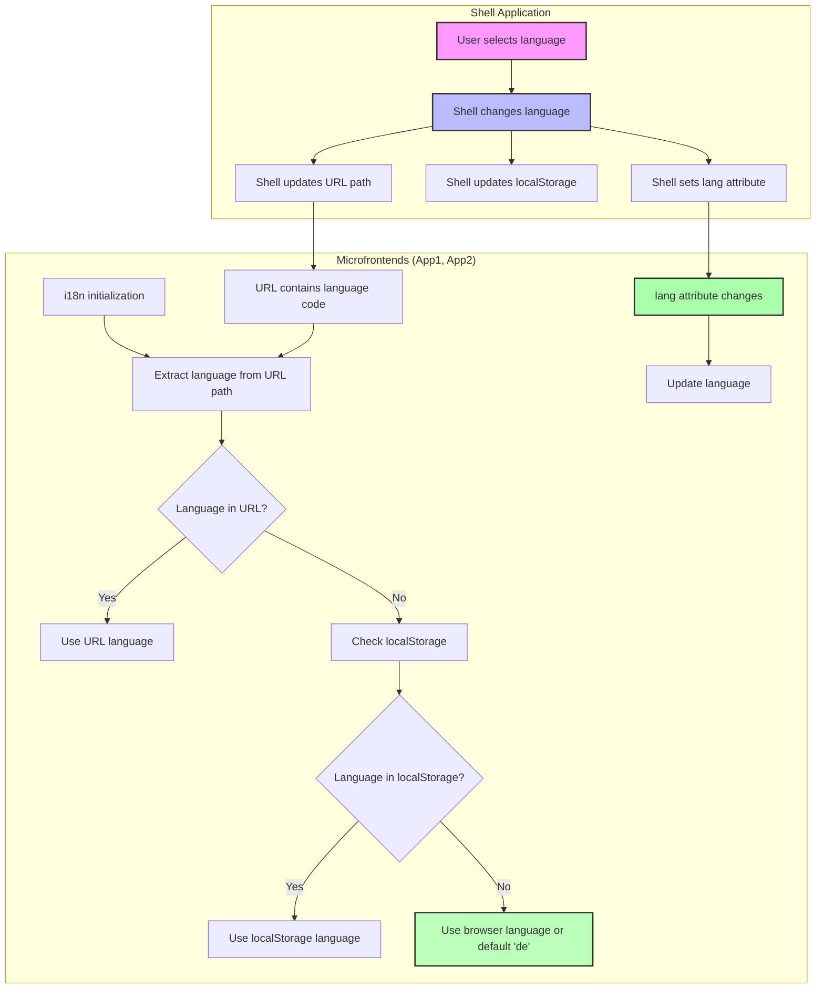

# Fully Independent Micro Frontend Architecture (Solution 3)

This solution implements a micro frontend architecture where each micro frontend is completely independent, sharing nothing with other micro frontends:

1. No shared dependencies across micro frontends (no import maps)
2. Web Components with Shadow DOM for CSS isolation
3. All applications built with React, each with its own bundled React instance
4. TanStack Router for robust routing in the shell
5. Custom events for cross-micro-frontend communication

## Architecture Overview

```
┌─────────────────────────────────────────────────────────┐
│                      Shell App                           │
│                      (TanStack Router)                   │
│                                                         │
│  ┌─────────────────┐        ┌─────────────────────┐     │
│  │      App1       │        │        App2         │     │
│  │   (Dashboard)   │        │      (Settings)     │     │
│  │                 │        │                     │     │
│  │  <app1-element> │        │   <app2-element>    │     │
│  │    [React]      │        │      [React]        │     │
│  │  Shadow DOM     │        │    Shadow DOM       │     │
│  └─────────────────┘        └─────────────────────┘     │
│                                                         │
└─────────────────────────────────────────────────────────┘
```

- **Shell**: Container application with TanStack Router that handles routing and composition
- **App1**: Dashboard micro frontend (React wrapped in Web Component with Shadow DOM)
- **App2**: Settings micro frontend (React wrapped in Web Component with Shadow DOM)

## Key Benefits of Complete Independence

1. **Team Autonomy**: Teams can work completely independently without dependency coordination
2. **Technology Freedom**: Each team can choose their own versions of React or even different frameworks
3. **Zero Shared Runtime**: No risk of conflicts between micro frontends
4. **Independent Deployment**: Any micro frontend can be deployed at any time
5. **Isolation by Default**: Shadow DOM provides complete CSS and DOM isolation
6. **Robust Routing**: TanStack Router provides type-safe routing with code splitting capabilities

## Implementation Details

### TanStack Router for Shell Routing

The shell application uses TanStack Router for advanced routing capabilities:

```javascript
// Define routes with TanStack Router
const rootRoute = createRootRoute({
  component: RootComponent,
});

const indexRoute = createRoute({
  getParentRoute: () => rootRoute,
  path: "/",
  component: HomePage,
});

const app1Route = createRoute({
  getParentRoute: () => rootRoute,
  path: "/app1",
  component: App1Page,
  beforeLoad: () => {
    // Dynamically load the app1 microfrontend
    loadMicrofrontend("app1");
  },
});

// Create and register the router
const routeTree = rootRoute.addChildren([indexRoute, app1Route, app2Route]);

export const router = createRouter({
  routeTree,
  defaultPreload: "intent",
});
```

### Web Components with Shadow DOM

Each micro frontend is encapsulated in a Web Component with Shadow DOM for style isolation:

```javascript
class App1Element extends HTMLElement {
  constructor() {
    super();
    // Create shadow root for isolation
    this.attachShadow({ mode: "open" });
  }

  connectedCallback() {
    // Container for React
    const container = document.createElement("div");
    this.shadowRoot.appendChild(container);

    // Isolated styles
    const style = document.createElement("style");
    style.textContent = `/* Styles for this component only */`;
    this.shadowRoot.appendChild(style);

    // Mount React inside Shadow DOM
    const root = ReactDOM.createRoot(container);
    root.render(<App />);
  }
}
```

### Bundled Dependencies (No Import Maps)

Each micro frontend bundles its own dependencies, including React and ReactDOM:

```javascript
// vite.config.js - No external dependencies
build: {
  rollupOptions: {
    output: {
      entryFileNames: "src/[name].js",
      chunkFileNames: "src/[name].js",
      assetFileNames: "src/[name].[ext]",
    },
    // No external dependencies - everything is bundled
  },
}
```

### Dynamic Loading in Shell

The shell dynamically loads micro frontends based on the current route:

```javascript
const loadMicrofrontend = (name) => {
  const scriptId = `${name}-script`;

  // Skip if already loaded
  if (document.getElementById(scriptId)) {
    return;
  }

  const script = document.createElement("script");
  script.type = "module";
  script.id = scriptId;

  const baseUrl = import.meta.env.DEV
    ? `http://localhost:${name === "app1" ? "5003" : "5004"}`
    : import.meta.env[`VITE_${name.toUpperCase()}_URL`];

  script.src = `${baseUrl}/src/index.js`;
  document.head.appendChild(script);
};
```

## Getting Started

1. Navigate to each directory (shell, app1, app2)
2. Run `npm install` to install dependencies
3. Run `npm start` to start development servers:
   - Shell: http://localhost:5000
   - App1: http://localhost:5003
   - App2: http://localhost:5004

## Comparison with Other Solutions

| Feature             | Solution 1 (Module Federation) | Solution 2 (Web Components + Import Maps) | Solution 3 (Fully Independent) |
| ------------------- | ------------------------------ | ----------------------------------------- | ------------------------------ |
| CSS Isolation       | Limited (can leak)             | Good (Shadow DOM)                         | Complete (Shadow DOM)          |
| Shared Dependencies | At build time                  | At runtime via Import Maps                | None (fully independent)       |
| Bundle Size         | Smaller (shared deps)          | Smaller (shared deps via CDN)             | Larger (each bundles deps)     |
| Team Independence   | Medium (shared runtime)        | Medium (shared deps)                      | Maximum (no shared code)       |
| Deployment          | Coordinated                    | Mostly independent                        | Completely independent         |
| Framework Freedom   | Limited to webpack ecosystem   | Limited to frameworks with ESM support    | Complete freedom               |
| Routing             | Custom or framework router     | Custom or framework router                | TanStack Router (advanced)     |

## Pros and Cons

### Pros

- Teams can work completely independently
- No coordination needed for deployments
- No risk of dependency conflicts
- Maximum technology freedom
- Robust isolation by default
- Advanced routing with TanStack Router
- Type-safe navigation (when using TypeScript)

### Cons

- Larger total bundle size (each MFE bundles its own dependencies)
- Potentially inconsistent user experience if not managed
- Needs more initial setup for communication patterns
- No code sharing (which can be good or bad depending on your perspective)

# Microfrontend Translation System

This document explains how the internationalization (i18n) system works across the shell and microfrontend applications.

## Architecture Overview

The application consists of:

- A **Shell** application that manages routing and coordinates language changes
- Two microfrontends (**App1** and **App2**) that each have their own isolated translation systems

## Supported Languages

The system currently supports:

- English (en)
- German (de) - Default language
- French (fr)
- Italian (it)
- Russian (ru)

## Translation Flow



## Language Detection Priority

1. **URL Path**: The first segment in the URL path (/en/app1, /de/app2, etc.)
2. **localStorage**: Previously selected user preference
3. **Browser Language**: User's browser language setting
4. **Default**: German (de) if no other language is detected

## How Translation Works

### Shell Application

The Shell application:

- Manages the primary language selection UI
- Updates the URL when language changes
- Has its own translation files for shell-specific content

### Microfrontends

Each microfrontend:

- Has its own isolated i18n configuration and translation files
- Detects language primarily from the URL path
- Falls back to localStorage, then browser settings if URL language is not available
- Contains only translations specific to its own functionality

## Handling URL Language Segments

When a user shares a URL with a language segment (e.g., `/fr/app1`):

- If the language is supported, the application displays in that language, regardless of the recipient's localStorage preferences
- If the language is unsupported, a 404 error is shown

## Translation Files Structure

Each application has its own locale files in a `locales` directory:

- `en.json` - English translations
- `de.json` - German translations
- `ru.json` - Russian translations

## Adding a New Language

To add a new language:

1. Add the language code to `SUPPORTED_LANGUAGES` in the shell and all microfrontends
2. Create new translation files in each application
3. Add the language to the resource configuration in each i18n initialization file
4. Update the language selector UI in the shell application
